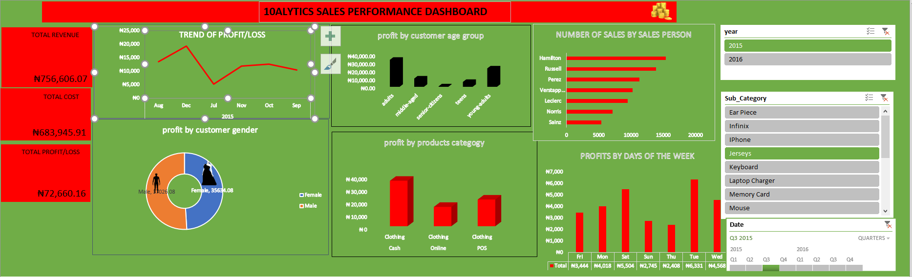

# Bright-store-sales-performance-dashboard

## DISCLAIMER:
All dataset and reports do not represent any company,institution or country but just a dummy dataset to demostrate capabilities of MS Excel

## INTRODUCTION:
One of the leading retail organizations operating in multiple states across Nigeria.

## PROBLEM STATEMENT:
The Company aims to gain valuable insights into customer behavior, sales performance, and factors influencing business outcomes to drive growth and enhance decision-making.
Analyze the vast amount of sales data, identify profit/loss trends, and uncover actionable insights that can drive strategic decision-making.

## DATA SOURCING:
- Total revenue
- Total cost
- Total Profit/Loss,
- Trend of profit/loss
- Sales person,
- Gender,
- Product and Product category etc.

 ## DATA TRANSFORMATION:
 With the use of tables that I use to clean and transform the data set
 

 Pivot tables and pivot charts even as you click, everything is dynamic depending on what you want to view.

## DASHBOARD VISUALISATION: 
I also incorporated visually compelling charts and graphs to make the dashboard intuitive and easy to comprehend for stakeholders at all levels.

![](

## ANALYSIS:

