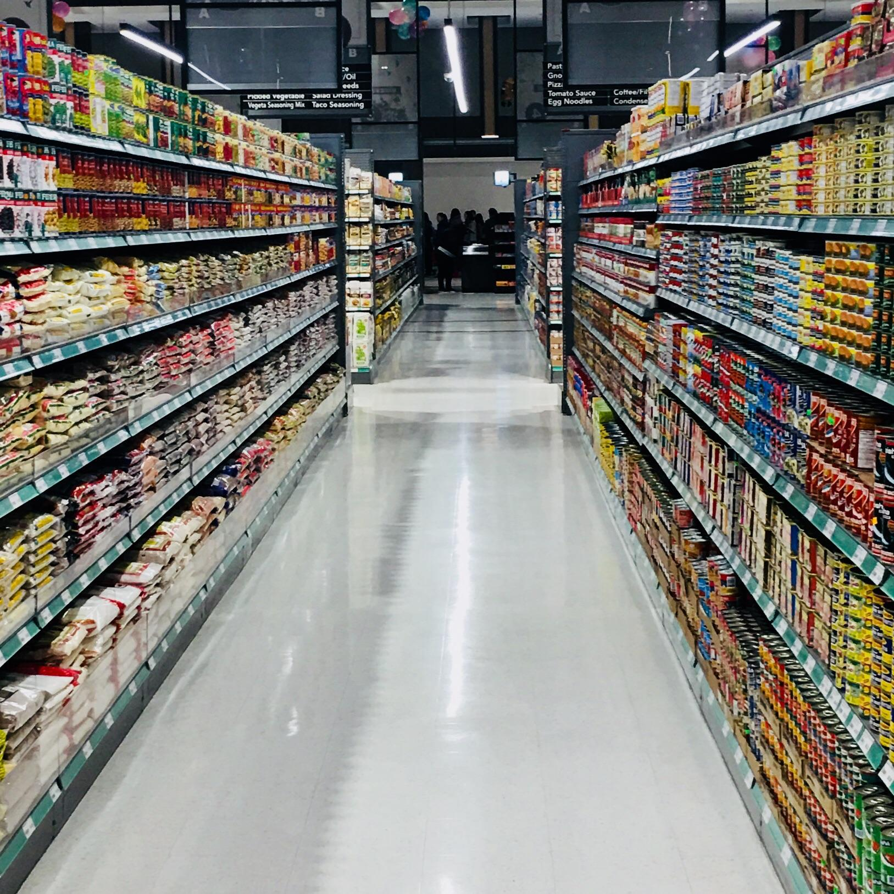
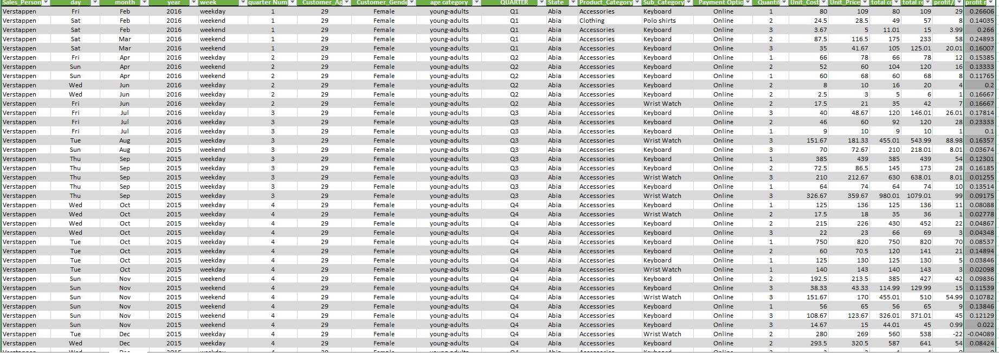
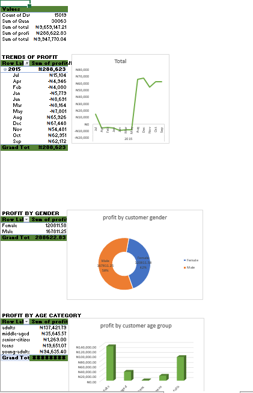
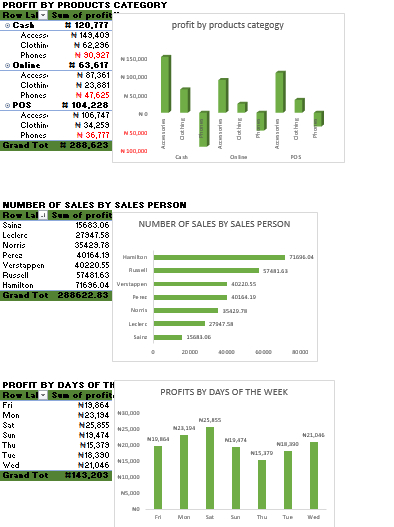
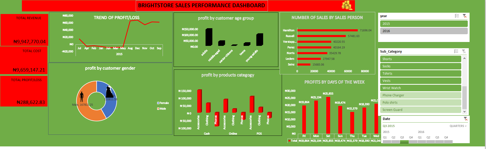
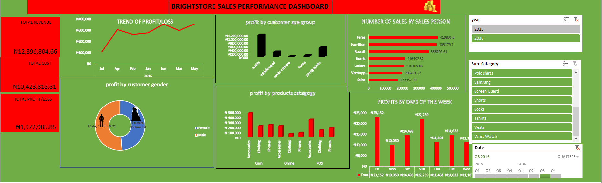

# Bright-store-sales-performance-dashboard

## DISCLAIMER:
All dataset and reports do not represent any company,institution or country but just a dummy dataset to demostrate capabilities of MS Excel

## INTRODUCTION:
One of the leading retail organizations operating in multiple states across Nigeria.

## PROBLEM STATEMENT:
The Company aims to gain valuable insights into customer behavior, sales performance, and factors influencing business outcomes to drive growth and enhance decision-making.
Analyze the vast amount of sales data, identify profit/loss trends, and uncover actionable insights that can drive strategic decision-making.

## DATA SOURCING:
- Total revenue
- Total cost
- Total Profit/Loss,
- Trend of profit/loss
- Sales person,
- Gender,
- Product and Product category etc.

 ## DATA TRANSFORMATION:
 With the use of tables that I cleaned and transformed the data set
 

 Pivot tables and pivot charts all connected to the slicers as you click, everything is dynamic depending on what you want to view.
 

## DASHBOARD VISUALISATION: 
I also incorporated visually compelling charts and graphs,slicers and timeline to make the dashboard intuitive and easy to comprehend for stakeholders at all levels.

## ANALYSIS FOR 2015:
- a total revenue was 9,947,770.04
- b total cost was 9,659,147.21
- c total profit/loss was 288,622.83
- trend of profit/loss for 2015 shows that there was a sharp rise of profit fro the month of may
- d adults had the most profit by customer age group which is 150,000
- e number of sales by sales person was Haliton with71696.04 sales
- f most profit by customer gender is the male gender with 167812.25
- g accessories had the most profit by product category with 150,000
- H sat.had the most profit by days of the week with the amount 25,855

 

 ## ANALYSIS FOR 2016:
 - a total revenue was 12,396,804
- b total cost was 10,423,818.81
- c total profit/loss was 1,972,985.85
- trend of profit/loss for 2015 shows that there was maximum profit all through
- d adults had the most profit by customer age group which is 150,000
- e number of sales by sales person was Perez with 410836.6 sales
- f most profit by customer gender is the male gender with 101,3538.21
- g accessories had the most profit by product category with 500,00
- H fri..had the most profit by days of the week with the amount 23,152 in the thrid quarter
 
  ## CONCLUSION:
  By leveraging the capabilities of MS Excel as valuable tool to monitor performance, and identify areas for improvement this will enable the Bright store team to make data-driven decisions, optimize sales strategies, and ultimately enhance the overall profitability of the business.
I kindly request you view and interact with this dashboard and provide suggestions on how I can further enhance it

